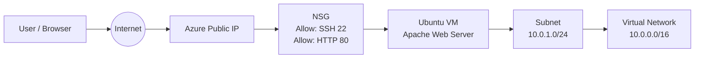

```mermaid

flowchart LR
  User[User / Browser]
  Internet((Internet))
  PIP[Azure Public IP]
  NSG[NSG\nAllow: SSH 22\nAllow: HTTP 80]
  VM[Ubuntu VM\nApache Web Server]
  VNet[Virtual Network\n10.0.0.0/16]
  Subnet[Subnet\n10.0.1.0/24]
  User --> Internet --> PIP --> NSG --> VM
  VM --> Subnet --> VNet

```